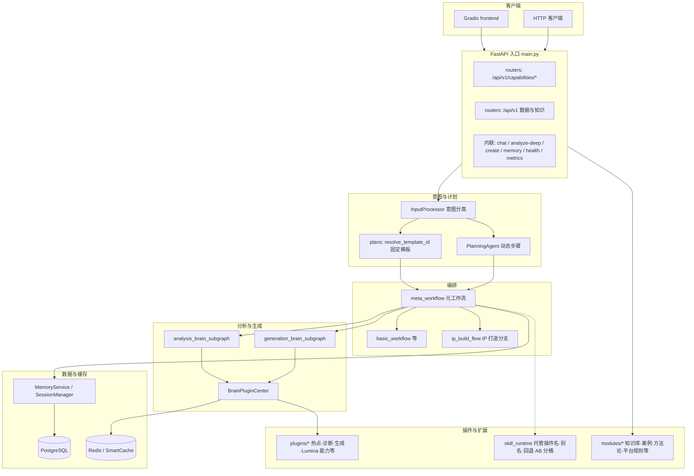

# AI 营销助手

面向营销与内容场景的 **智能分析与创作后端**：FastAPI 暴露对话、深度分析、内容生成、画像与记忆、文档与案例沉淀；并对齐 [Lumina](https://lumina-ai.cn/product) 产品形态的 **四模块能力接口**（内容方向榜单、案例库、内容定位矩阵、每周决策快照）。编排以 **LangGraph** 为主，模型与嵌入默认走 **阿里云 DashScope（Qwen）**。

---

## 系统架构

整体是 **API 层 → 意图与 Plan → 元工作流（LangGraph）→ 分析脑/生成脑子图 → 脑插件中心 → 具体插件**，数据经 **MemoryService / 会话** 落 **PostgreSQL**，热点与中间结果经 **Redis / SmartCache**。



**要点简述**

| 层次 | 职责 |
|------|------|
| **意图** | `core/intent`：`InputProcessor` 等完成闲聊/指令/文档问答等分流；缺有效 DashScope Key 时意图链路会显式失败（如 `IntentRecognitionUnavailableError` / HTTP 503），避免静默降级。 |
| **Plan** | `plans/registry` + `plans/templates`：固定模板步骤（IP 诊断、账号打造、内容矩阵、四模块能力模板等）；无匹配时模板 ID 为 `dynamic`，由 `PlanningAgent` 生成步骤。 |
| **元工作流** | `workflows/meta_workflow.py`：策略/规划与编排（分析子图、生成子图、检索、记忆查询等）；集成 `core/failure_codes` 与 trace；分析/生成失败时可走插件回退。 |
| **脑插件** | `core/brain_plugin_center.py` 维护分析脑 / 生成脑插件清单（`ANALYSIS_BRAIN_PLUGINS`、`GENERATION_BRAIN_PLUGINS`），各插件在 `plugins/` 下 `register`。 |
| **skill_runtime** | `core/skill_runtime.py`：对固定 Plan 中出现的插件主名做 **候选链（含 `*_plugin` 别名）**、**重试回退列表**、按 `user_id` 的 **A/B 分桶**（`skill_ab_bucket`），与 `meta_workflow` 的 `analyze` / `generate` 节点配合。 |
| **业务模块** | `modules/`：`knowledge_base`、`case_template`、`methodology`、`platform_rules`、`sample_library`、`data_loop` 等，由路由或服务注入。 |

---

## 请求路径概览

| 路径类型 | 典型入口 | 说明 |
|----------|----------|------|
| 对话与深度分析 | `POST .../frontend/chat`、`POST .../analyze-deep/raw` 等 | 经意图 →（固定或动态）Plan → `meta_workflow` |
| Lumina 四模块 | `GET .../api/v1/capabilities/*` | 见 `routers/capability_api.py` |
| 数据与知识 | `.../api/v1` 下案例、方法论、数据闭环等 | 见 `routers/data_and_knowledge.py` |
| 观测 | `GET /health`、`GET /metrics` | Prometheus 指标；深度链路可带 `trace_id`、`failure_code`、`skill_ab_bucket`（视接口而定） |

更全的 HTTP 清单见 [对外 API 参考](./docs/API_REFERENCE.md)。

---

## 你能用它做什么

| 方向 | 说明 |
|------|------|
| **意图与路由** | 闲聊、指令、文档问答等多类意图识别与分流 |
| **记忆与画像** | 短期/长期记忆、会话上下文、标签与画像更新 |
| **分析与生成** | 深度分析、文案与脚本类生成、热点与诊断类插件扩展 |
| **对外能力** | Lumina 四模块 REST 能力（榜单、案例库、矩阵、周快照） |
| **运营与观测** | `/health`、`/metrics`；生产 Compose 可选 Prometheus + Grafana |

---

## 技术栈

- **Web**：FastAPI、Uvicorn / Gunicorn  
- **编排与 AI**：LangGraph、LangChain、DashScope（Qwen / 嵌入）  
- **数据**：PostgreSQL、SQLAlchemy（异步）、Redis  
- **可选界面**：Gradio（`frontend/app.py`）  
- **部署**：Docker Compose；生产镜像见 `Dockerfile.optimized`  

**建议环境**：Python 3.11+；本地开发需 Docker（仅跑数据库与 Redis 时可用 `docker-compose.dev.yml`）。

---

## 快速开始

### 1. 准备环境文件

**一键生产部署**（API + Postgres + Redis，以及可选监控等）：

```bash
# Linux / macOS
cp .env.prod.example .env.prod

# Windows PowerShell
Copy-Item .env.prod.example .env.prod
```

编辑 `.env.prod`：至少配置 `DASHSCOPE_API_KEY`，生产环境务必设置强 `POSTGRES_PASSWORD` 等数据库相关变量。

**仅本地开发**（Docker 只起 Postgres + Redis，应用在宿主机跑）：

```bash
cp .env.dev.example .env    # 或 Copy-Item .env.dev.example .env
```

编辑 `.env`，填入 `DASHSCOPE_API_KEY` 及与 `docker-compose.dev.yml` 一致的 `DATABASE_URL`、`REDIS_URL`。

### 2. 启动方式

**方式 A：生产 / 演示（推荐用 Compose 全栈）**

必须使用 `--env-file .env.prod`，否则 Postgres 等变量无法正确解析：

```bash
docker compose --env-file .env.prod -f docker-compose.prod.yml up -d
```

默认暴露：

- API：`http://localhost:8000`  
- Prometheus：`http://localhost:9090`（如启用该服务）  
- Grafana：`http://localhost:3000`（默认账号见 `docker-compose.prod.yml` 内注释，生产请修改）  

另包含可选的 **memory-optimizer** 服务（独立构建目标），用于记忆优化任务，按需在 Compose 中启用或保持现状即可。

**方式 B：本地开发**

```bash
docker compose -f docker-compose.dev.yml up -d
pip install -r requirements.txt
uvicorn main:app --reload --port 8000
```

启动后：

- 交互文档：<http://localhost:8000/docs>  
- 健康检查：`GET /health`  

**可选：Gradio 界面**（需后端已启动，默认连 `http://localhost:8000`）：

```bash
set BACKEND_URL=http://localhost:8000   # Windows CMD；PowerShell 用 $env:BACKEND_URL=...
python frontend/app.py
```

---

## API 调用示例

```bash
curl http://localhost:8000/health

curl -X POST http://localhost:8000/api/v1/analyze-deep/raw \
  -H "Content-Type: application/json" \
  -d "{\"user_id\": \"test001\", \"raw_input\": \"帮我推广华为手机\"}"

# Lumina 四模块能力（GET）
curl "http://localhost:8000/api/v1/capabilities/content-direction-ranking?platform=xiaohongshu"
curl "http://localhost:8000/api/v1/capabilities/case-library?page=1&page_size=10"
curl "http://localhost:8000/api/v1/capabilities/content-positioning-matrix"
curl "http://localhost:8000/api/v1/capabilities/weekly-decision-snapshot"
```

---

## 测试与验证

```bash
# 综合测试（意图、记忆、流程、插件等）
python scripts/test_comprehensive/runner.py

# 四模块能力接口（需服务已启动）
python scripts/verify_capability_apis.py

# 离线：trace / 失败码 / 继续短句 / skill_runtime 与固定 Plan 对齐（无需起 DB）
python scripts/test_four_step_mvp_checks.py

# 跳过较慢步骤（例如不调 AI，仅部分接口）
# Linux / macOS: SKIP_SLOW=1 python scripts/verify_capability_apis.py
# Windows PowerShell: $env:SKIP_SLOW=1; python scripts/verify_capability_apis.py
```

更多脚本说明见 [scripts/README.md](./scripts/README.md)。

---

## 仓库结构

```
├── main.py                 # FastAPI 应用入口（路由挂载、核心对话与分析入口）
├── database.py             # 异步 SQLAlchemy、会话工厂、部分 ORM
├── core/                   # 意图、脑插件中心、skill_runtime、失败码、文档与检索等
│   ├── intent/             # InputProcessor、IntentAgent、PlanningAgent
│   ├── brain_plugin_center.py
│   ├── skill_runtime.py
│   ├── failure_codes.py
│   └── ...
├── workflows/              # LangGraph：meta_workflow、子图、IP 打造、策略编排等
├── plans/                  # 固定 Plan 注册与模板（见 plans/README.md）
├── domain/                 # 领域逻辑（内容分析/生成、记忆领域服务）
├── services/               # AI、输入、文档、检索、热点刷新、预测等应用服务
├── plugins/                # 按脑注册的分析/生成/热点/能力插件
├── routers/                # 能力接口、数据与知识等 APIRouter
├── modules/                # 知识库、案例、方法论、平台规则、数据闭环等可插拔模块
├── memory/                 # 会话与对话状态
├── models/                 # Pydantic 请求体等
├── frontend/               # Gradio 前端
├── intake_guide/           # IP 打造 Intake 问题与推断
├── config/                 # YAML、媒体规格、检索与模型相关配置
├── cache/                  # SmartCache 等
├── monitoring/             # Prometheus / Grafana 配置
├── scripts/                # 测试、验证、运维脚本
├── docs/                   # 部署、API、环境变量、架构讨论等
└── plugin_template/        # 新插件/Plan 示例
```

---

## 环境变量

| 变量 | 说明 |
|------|------|
| `DASHSCOPE_API_KEY` | 阿里云 DashScope API Key（调用模型与嵌入时必需） |
| `DATABASE_URL` | 异步 PostgreSQL 连接串（与 SQLAlchemy/asyncpg 一致） |
| `REDIS_URL` | Redis 连接串 |
| `BAIDU_SEARCH_API_KEY` | 可选，用于百度搜索等网络检索能力 |

完整说明见 [环境变量参考](./docs/ENV_KEYS_REFERENCE.md)。**不要将** `.env`、`.env.dev`、`.env.prod` 提交到 Git（已在 `.gitignore` 中忽略）。

---

## 更多文档

| 文档 | 内容 |
|------|------|
| [快速开始](./docs/QUICK_START.md) | 克隆、配置、启动、首调 |
| [部署指南](./docs/DEPLOYMENT.md) | Docker 与本地细节 |
| [对外 API 参考](./docs/API_REFERENCE.md) | 全部 REST 路径与说明 |
| [Lumina 四模块映射](./docs/LUMINA_MODULES_MAPPING.md) | 产品与插件对应关系 |
| [plans 包说明](./plans/README.md) | 固定 Plan 注册与新增模板步骤 |
| [环境变量参考](./docs/ENV_KEYS_REFERENCE.md) | 键名与用途 |
| [故障排查](./TROUBLESHOOTING.md) | 常见问题 |
| [Python 3.14 兼容性](./PYTHON314_COMPATIBILITY.md) | 版本说明 |

---

## 许可

若仓库根目录存在 `LICENSE` 文件，以该文件为准。
