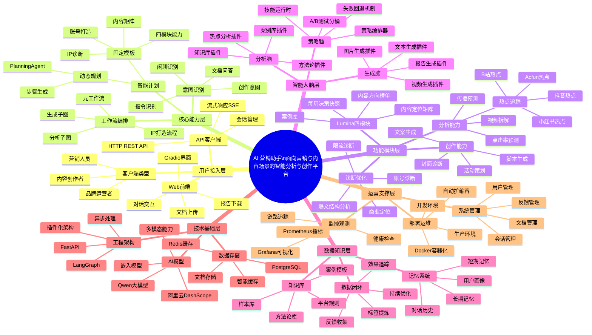
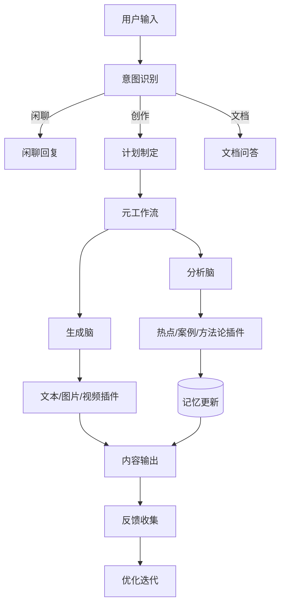

# AI 营销助手 - 产品脑图



---

## 产品架构分层详解

### 1. 用户接入层
| 组件 | 功能描述 |
|------|----------|
| Gradio前端 | 交互式Web界面，支持对话、文件上传 |
| REST API | 完整的HTTP API接口，支持第三方集成 |
| 会话管理 | 支持多轮对话、会话续期、上下文保持 |

### 2. 核心能力层
| 组件 | 功能描述 |
|------|----------|
| InputProcessor | 意图分类与输入标准化 |
| PlanningAgent | 动态步骤规划与任务分解 |
| Meta Workflow | LangGraph编排的元工作流 |

### 3. 功能模块层 (Lumina对齐)
| 模块 | 能力描述 |
|------|----------|
| 内容方向榜单 | 各平台热门内容趋势分析 |
| 案例库 | 行业优秀案例检索与学习 |
| 内容定位矩阵 | 账号定位与内容策略规划 |
| 每周决策快照 | 数据驱动的运营决策建议 |

### 4. 智能大脑层
| 大脑类型 | 插件示例 |
|----------|----------|
| 分析脑 | 热点分析、案例库、方法论、知识库 |
| 生成脑 | 文本、图片、视频、报告生成 |
| 策略脑 | 编排器、A/B测试、回退机制 |

### 5. 数据知识层
| 类型 | 内容 |
|------|------|
| 知识库 | 营销方法论、平台规则、案例模板 |
| 记忆系统 | 用户画像、对话历史、偏好学习 |
| 数据闭环 | 效果追踪、反馈优化、标签体系 |

### 6. 技术基础层
| 技术 | 用途 |
|------|------|
| DashScope/Qwen | 大模型推理与嵌入 |
| LangGraph | 工作流编排 |
| PostgreSQL | 持久化存储 |
| Redis | 缓存与会话 |

---

## 核心流程图



---

## 插件生态全景

```
plugins/
├── 热点追踪类
│   ├── bilibili_hotspot          # B站热点
│   ├── douyin_hotspot            # 抖音热点
│   ├── xiaohongshu_hotspot       # 小红书热点
│   └── acfun_hotspot             # Acfun热点
├── 内容生成类
│   ├── text_generator            # 文案生成
│   ├── image_generator           # 图片生成
│   ├── video_generator           # 视频生成
│   ├── script_replication        # 脚本仿写
│   └── text_viral_structure      # 爆文结构
├── 诊断分析类
│   ├── cover_diagnosis           # 封面诊断
│   ├── rate_limit_diagnosis      # 限流诊断
│   ├── viral_prediction          # 传播预测
│   └── ctr_prediction            # CTR预测
├── 能力插件类
│   ├── case_library              # 案例库
│   ├── methodology               # 方法论
│   └── knowledge_base            # 知识库
└── 报告生成类
    └── report_generation         # Word报告
```

---

*文档生成时间: 2026-03-25*
*产品版本: v1.0.0*
